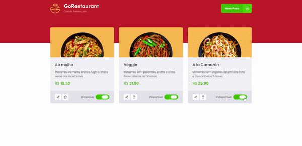

  

## 📖 Sobre
Desafio opcional do chapter 2 da trilha React.js, neste desafio recebemos uma aplicação de um restaurante onde devemos fazer a migração dela de Javascript para Typescript e também de Class Components para Function Components. Até agora o desafio mais puxado em minha opnião mas que me fez aprender muito sobre Typescript principalmente.

## 🏆 Desafios
  - [x] Fazer migração de Javascript para Typescript
  - [x] Fazer migração de Class Components para Function Components
  - [x] Fixar conhecimentos sobre Typescript
  - [x] Preparar ambiente Typescript numa aplicação já existente

## 📸 Imagem

  

## Autor 🕴🏽
#### Feito com 🤎 por *[Gabriel Bittencourt Penteado](https://www.linkedin.com/in/gabriel-bittencourt-penteado/)*. Entre em contato! 👋🏽